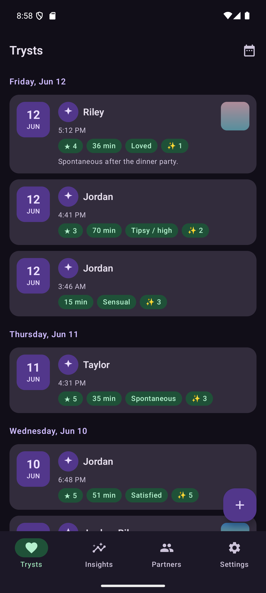
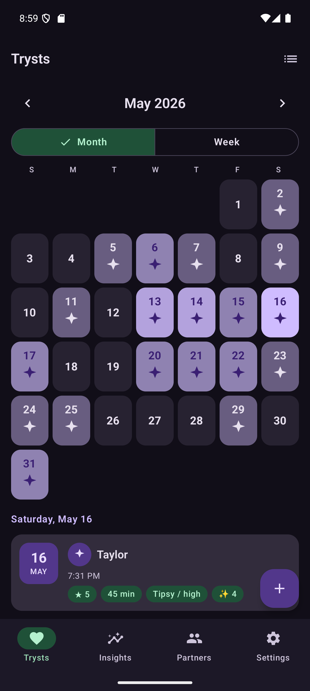
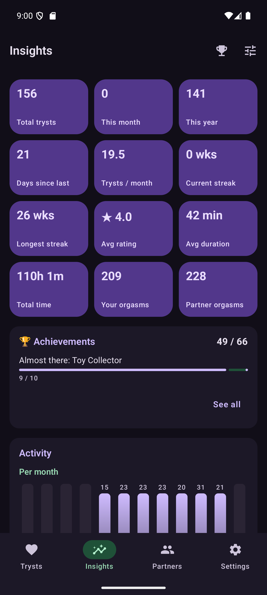
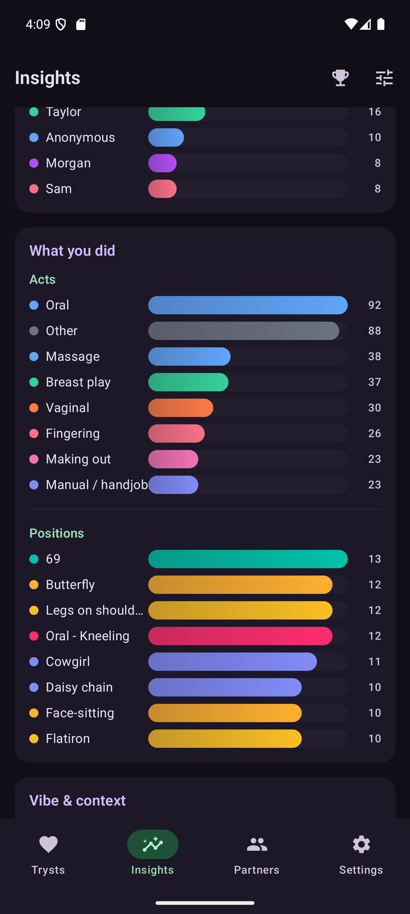
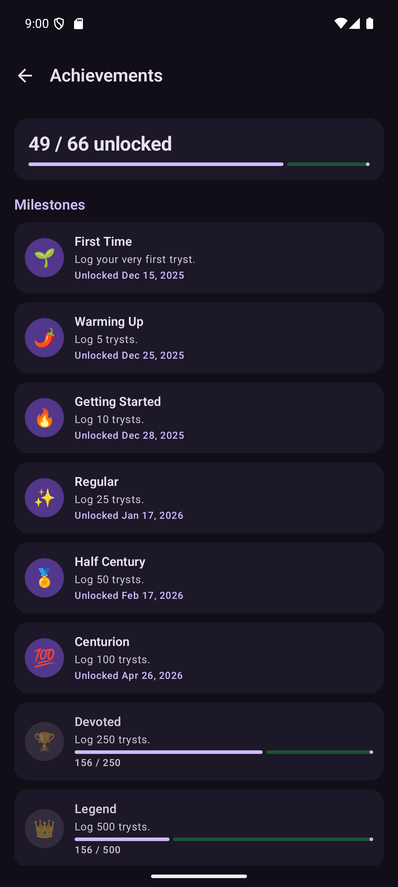
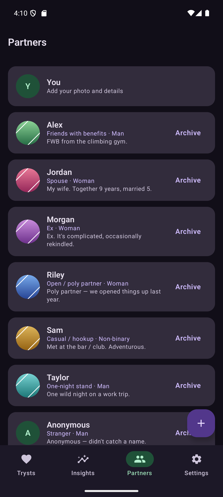

<div align="center">

# Tryst

### A private, local-only journal for your intimate life — encrypted, offline, and open source.

[](LICENSE)
[](#built-with)
[](#built-with)
[](#built-with)
[](#why-tryst)
[](CHANGELOG.md)

Tryst keeps your most personal data on your phone and nowhere else — no account, no sync,
and **no internet permission at all**, so the app *cannot* send your data anywhere.
Inspired by other tracking apps you need to pay for, and built so privacy is the feature, not a footnote.

<table>
  <tr>
    <td align="center"><br><sub><b>Trysts</b></sub></td>
    <td align="center"><br><sub><b>Calendar heatmap</b></sub></td>
    <td align="center"><br><sub><b>Insights</b></sub></td>
  </tr>
  <tr>
    <td align="center"><br><sub><b>Breakdowns</b></sub></td>
    <td align="center"><br><sub><b>Achievements</b></sub></td>
    <td align="center"><br><sub><b>Partners</b></sub></td>
  </tr>
</table>

</div>

## Why Tryst

Privacy isn't a setting here — it's the architecture.

- 🚫 **No network, ever.** The app declares no `INTERNET` permission, and a build-time CI guard
  fails the build if one ever sneaks in. Data physically cannot leak to a server.
- 🔒 **Encrypted at rest.** Entries live in an encrypted **SQLCipher** database; photos are
  **Tink AES-256-GCM** blobs in the app's private storage — never your gallery, MediaStore, or any cloud.
- 🔑 **Locked to you.** A 6-digit app PIN (separate from your phone's), optional biometric unlock,
  auto-lock the moment Tryst leaves the screen, and `FLAG_SECURE` to blank screenshots and the
  app-switcher preview. The key is derived from your PIN and double-wrapped by a hardware-backed
  Keystore key (StrongBox when available).
- 📵 **Zero tracking.** No analytics, ads, or crash-reporting SDKs of any kind — none are in the build.
- 📤 **Your data is yours.** The only way it leaves the device is a manual, password-encrypted
  backup you control. There is no password recovery, because there is no server.
- 🔍 **Verifiable.** GPLv3 and fully open source, so every promise above is auditable — and F-Droid
  builds it from this source.

## Features

- **Rich encounter logging** — date, time, duration, partners, acts, positions, protection, mood,
  place, occasion, toys, kinks, a 1–5 rating, orgasms, notes, and encrypted photo attachments.
- **Categories you own** — Tryst ships a small, non-explicit starter set; **add or rename your own**
  acts, kinks, positions, and toys, and they count fully across Insights, search, and Achievements.
- **Partners & a self profile** — named or anonymous partners with relationship type and optional
  demographics (age, ethnicity, height, body type, location) and avatars, plus your own profile.
- **Insights** — a pure-Kotlin stats engine: totals, week streaks, averages, monthly & weekday
  trends, and per-attribute breakdowns. Reorder/hide tiles and cards, pick a chart style per card
  (bars / line / donut), with stable per-type colors. Charts are **hand-drawn** — no chart dependency.
- **Achievements** — dozens of milestones, streaks, and variety badges, derived from your log with
  progress bars and unlock dates. No extra storage.
- **Calendar** — a tonal activity heatmap with per-day act icons, month/week toggle, and swipe to
  page. Land on it by default if you like.
- **Backup & import** — full-fidelity password-encrypted export/restore (photos included), plus a
  CSV importer with column mapping to bring history in from other apps.
- **Thoughtful polish** — light/dark themes + Material You, tablet/foldable adaptive layouts, a
  discard-changes guard so a stray tap never eats a half-finished entry, a type-to-confirm reset,
  and an in-app *What's new*.

## Built with

Kotlin · Jetpack Compose + Material 3 · Room over **SQLCipher** · Google **Tink** (media crypto) ·
Hilt · Coroutines/Flow. `minSdk 31` (Android 12) · `compileSdk`/`targetSdk 36`. **No networking
libraries at all**, and charts are hand-drawn in Compose — the dependency surface stays tiny and
fully FOSS. Architecture is MVVM + repository with a package-by-feature layout; the stats and
achievements engines are stateless and JVM-unit-tested. See
[docs/ARCHITECTURE.md](docs/ARCHITECTURE.md) and [docs/FLOWCHARTS.md](docs/FLOWCHARTS.md).

## Building

Full toolchain notes are in [docs/SETUP_WINDOWS.md](docs/SETUP_WINDOWS.md). The essentials:

```powershell
$env:JAVA_HOME="C:\Program Files\Android\Android Studio\jbr"
.\gradlew.bat assembleDebug            # build the debug APK
.\gradlew.bat checkNoNetworkDebug      # anti-leak guard: fails if any network permission appears
.\gradlew.bat testDebugUnitTest        # JVM unit tests
.\gradlew.bat detekt ktlintCheck       # quality gates
```

Screenshots are black by design on-device (`FLAG_SECURE`).

## Status

✅ **Shipped.** Current release **v0.3.1** (versionCode 4). Distribution is **F-Droid**, which builds
and signs from this source — Tryst ships no binary and commits no signing key. The **0.3.x** line makes
every built-in catalog a small, non-explicit starter set — acts and kinks in 0.3.0, positions and toys
in 0.3.1 — with everything you add (or had already logged) kept as a fully-functional **custom** entry
(schema v11, lossless migration). It also adds in-place renaming, most-used options inline in the
editor, and an option to open Trysts in calendar view by default.

Full release notes are in [CHANGELOG.md](CHANGELOG.md); the milestone history and pre-release audit
program live in [docs/ROADMAP.md](docs/ROADMAP.md), and post-1.0 plans in
[docs/ROADMAP_FUTURE.md](docs/ROADMAP_FUTURE.md).

## Documentation

| Doc | What |
|-----|------|
| [REQUIREMENTS.md](docs/REQUIREMENTS.md) | Functional & non-functional requirements |
| [THREAT_MODEL.md](docs/THREAT_MODEL.md) | Adversaries, mitigations, residual risk |
| [SECURITY_DESIGN.md](docs/SECURITY_DESIGN.md) | Encryption & key management |
| [DATA_MODEL.md](docs/DATA_MODEL.md) | Entities & fields (schema v11) |
| [ARCHITECTURE.md](docs/ARCHITECTURE.md) | Stack & module layout |
| [FLOWCHARTS.md](docs/FLOWCHARTS.md) | Visual maps of the core logic flows |
| [ROADMAP.md](docs/ROADMAP.md) | Milestones & the 12-pass pre-release audit |
| [ROADMAP_FUTURE.md](docs/ROADMAP_FUTURE.md) | Post-1.0 roadmap (shipped + planned) |
| [DECISIONS.md](docs/DECISIONS.md) | Decision log & open questions |
| [RELEASE.md](docs/RELEASE.md) | Cut-a-release checklist + F-Droid submission |
| [CHANGELOG.md](CHANGELOG.md) | Per-release notes |
| [SETUP_WINDOWS.md](docs/SETUP_WINDOWS.md) | Build & run on Windows |

## License

**GPLv3.** Tryst is free, open-source software under the
[GNU General Public License v3.0](LICENSE) — so anyone can verify the privacy promises above, and any
redistributed version must also be GPLv3 with source available. Third-party components and their
licenses are listed in [THIRD_PARTY_NOTICES.md](THIRD_PARTY_NOTICES.md) and in-app under
**Settings → About** (all GPLv3-compatible).
