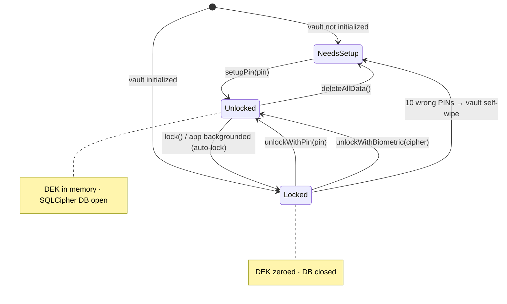
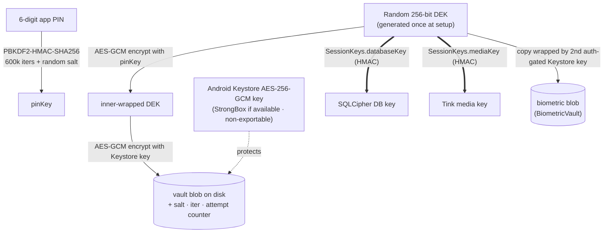
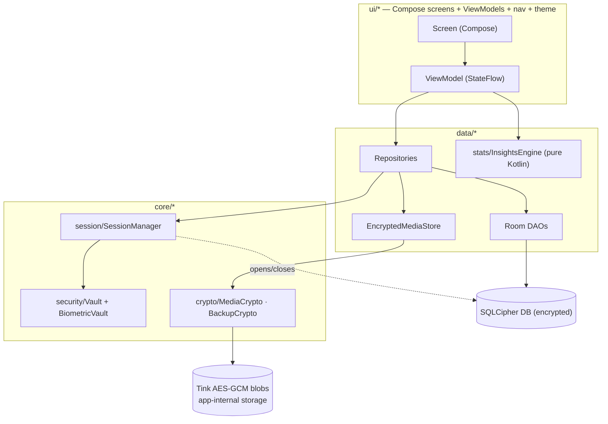
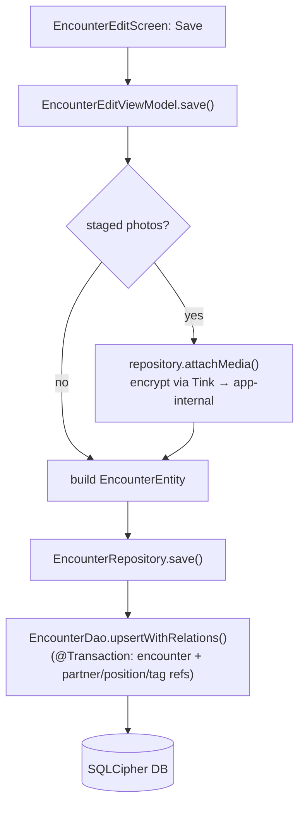
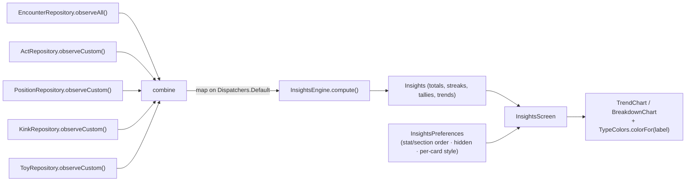
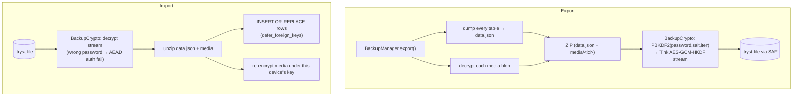
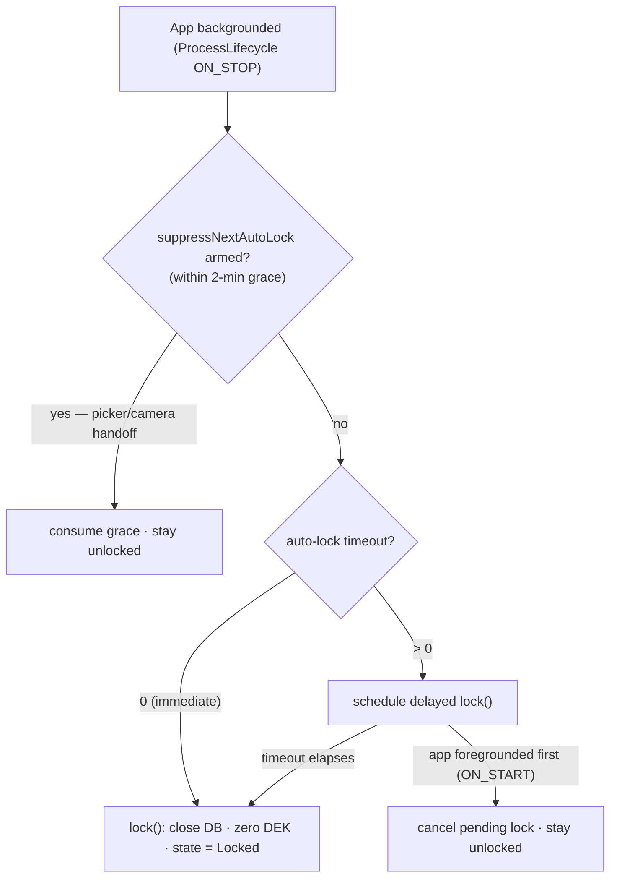
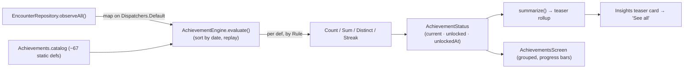

# Tryst — Logic Flowcharts

> **Status:** Live — v0.3.2. Visual maps of how the app's core logic works, so a change can be
> reasoned about before touching code. Diagrams are [Mermaid](https://mermaid.js.org/) — they render on
> GitHub and in most Markdown viewers. Keep these in sync when the corresponding code changes.

Contents: [Lock lifecycle](#1-app-lock-lifecycle-state-machine) ·
[Key model](#2-key-model-dek-double-wrap) · [Unlock sequence](#3-unlock-sequence) ·
[Layered data flow](#4-layered-architecture--data-flow) · [Encounter save](#5-encounter-save-flow) ·
[Insights pipeline](#6-insights-pipeline) · [Backup export/import](#7-backup-export--import) ·
[Auto-lock handoff](#8-auto-lock--picker-handoff) · [Achievements](#9-achievements-derivation).

---

## 1. App lock lifecycle (state machine)

`SessionManager.state: StateFlow<LockState>` drives `MainActivity`, which renders the setup screen,
the lock screen, or the unlocked app. While **Unlocked** the DEK is in memory and the SQLCipher DB is
open; every other state has the DEK zeroed and the DB closed.



## 2. Key model (DEK double-wrap)

One random 256-bit **Data Encryption Key (DEK)** protects everything. It is persisted on disk only
**double-wrapped**: an inner layer from the app PIN, an outer layer from a hardware-backed Android
Keystore key. The DB and media keys are *derived* from the DEK (HMAC subkeys via `SessionKeys`), so
they never need separate storage. See [SECURITY_DESIGN.md](SECURITY_DESIGN.md).



## 3. Unlock sequence

Unlock peels the two wrap layers (Keystore outer, PIN-derived inner). A wrong PIN fails the inner
AEAD authentication, increments the attempt counter, and after 10 failures the vault self-wipes.

```mermaid
sequenceDiagram
    actor User
    participant Lock as LockScreen / LockViewModel
    participant SM as SessionManager
    participant V as Vault
    participant KS as Android Keystore
    participant DBF as TrystDatabaseFactory

    User->>Lock: enter PIN
    Lock->>SM: unlockWithPin(pin)
    SM->>V: unlock(pin)
    V->>KS: strip outer layer (Keystore key)
    V->>V: PBKDF2(pin, salt, iter) → pinKey;<br/>strip inner layer
    alt wrong PIN
        V-->>SM: WrongPinException (attempt++)
        Note over V: 10 fails → wipe() → NeedsSetup
    else correct PIN
        V-->>SM: DEK
        SM->>DBF: create(databaseKey(DEK)) + force-open
        Note over SM: a bad key fails here, not later
        SM-->>Lock: state = Unlocked
    end
```

## 4. Layered architecture & data flow

MVVM + repository, unidirectional. UI never touches crypto or the DB directly; everything sensitive
flows through `SessionManager` (which only yields a DB/keys while unlocked).



## 5. Encounter save flow

Photos are *staged* on pick and only committed (encrypted) on Save; the encounter row and all its
M:N links are written in one transaction.



## 6. Insights pipeline

Five reactive sources are combined and folded into an immutable `Insights` off the main thread; the
screen layers user customization (order/hidden/per-card chart style) on top, with stable per-type
colors. The engine is pure Kotlin (JVM-unit-tested, no Android).



## 7. Backup export / import

Live data is device-bound (Keystore-wrapped DEK), so backups are **re-encrypted** under a key derived
from the user's backup password — not a raw DB copy. See [EXPORT_FORMAT.md](EXPORT_FORMAT.md).



## 8. Auto-lock & picker handoff

Backgrounding locks after the user's **auto-lock delay** (Settings → General; default **immediate**). A
non-zero delay schedules a process-scoped `lock()` that is cancelled if the app returns to the foreground
first (`ON_START` → `onAppForegrounded`). Handing off to the OS photo picker / camera unavoidably
backgrounds the app, so those launches arm a one-shot ~2-minute grace that skips exactly one auto-lock.



## 9. Achievements (derivation)

Like insights, achievements hold **no state** — `AchievementEngine` replays the chronologically-sorted
log against each static `AchievementDef` to derive progress and the date it unlocked. The Insights
screen shows a teaser; the trophy icon opens the full screen.



